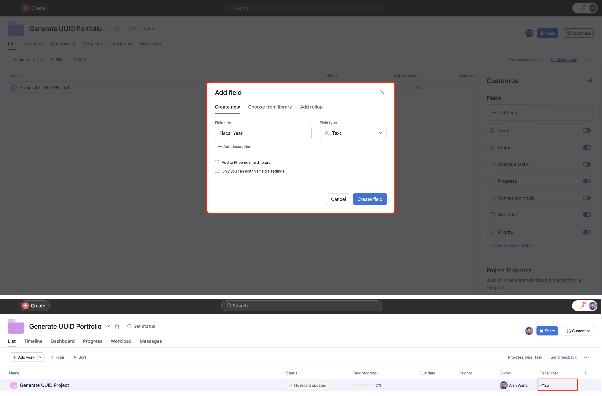
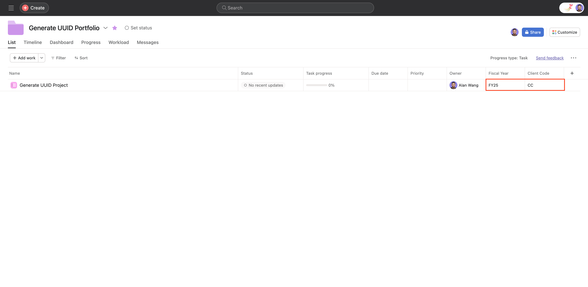

# Generate a unique UUID when task is added to a project

### Problem:
You want to generate a unique UUID for each new task you add to your project. Currently you have to do this manually each time you create a task.


### Solution:

Create a custom script rule that generates a unique UUID for your tasks when it gets added to your project.

### Scenario Setup:
1. Create a portfolio called **"Generate UUID Portfolio"**
2. Create a project called **"Generate UUID Project"** and add it to the **"Generate UUID Portfolio"** portfolio
   <details>
   <summary>more details</summary>

   
   
   
   </details>
3. Inside of the **"Generate UUID Portfolio"** portfolio, create and set two project custom fields to be used with the script to generate UUIDs for the tasks:
   <details>
   <summary>Create and set <b>"Fiscal Year"</b> custom field</summary>
   
   
   </details>
   <details>
   <summary>Create and set <b>"Client Code"</b> custom field</summary>
   
   
   </details>
4. Set values for the **"Fiscal Year"** and **"Client Code"** custom field for your **"Generate UUID Project"** project.
   <details>
   <summary>more details</summary>
   
   
   </details>

### Setup Rule Trigger:

1. Inside of your **"Generate UUID Project"** project navigate to **"Customize" -> "Rules" -> "+ Add rule" -> "Create custom rule"**
   <details>
   <summary>more details</summary>
   
   
   
   </details>
2. Configure the following:
   - **"+ When..."** -> **"Task is added to this project"**
   - **"Check if…"** -> Remove this card
   - **"Do this…"** -> **"External actions"** -> **"Run custom script"** -> Edit and copy over the script in the [Script](#script) section below
  

### Script
#### Pre-requisites:

Note down the following details for the below script:
1. `<YOUR_FISCAL_YEAR_CUSTOM_FIELD_GID>`: Replace `<PORTFOLIO_GID>` in the following link `https://app.asana.com/api/1.0/portfolios/<PORTFOLIO_GID>/custom_field_settings` and open that link up in the same browser as your logged in user. Find and use the `gid` of the **"Fiscal Year"** custom field.
   <details>
   <summary>more details</summary>

   
   </details>
2. `<NAME_OF_YOUR_CLIENT_CODE_CUSTOM_FIELD>`: Use the name you set when you were creating your **"Client Code"** custom field. In this case we named it **"Client Code"**.

   **NOTE:** this is case sensitive but you can modify the script to make this case-insensitive as needed.

We advise you to copy and paste this script into your code editor for editing. Once you're satisfied with your changes, simply copy the script into the custom field rule editor.

```javascript
/**
 * What's in scope?
 * 1. (number) project_gid, workspace_gid, task_gid (only if triggered on a task)
 * 2. (function) log - this behaves like console.log and takes any number of parameters
 * 3. (object) *ApiInstance - for each group of APIs, an object containing functions to call the APIs; for example:
 *    tasksApiInstance.getTask(...)
 *    goalsApiInstance.addFollowers(...)
 * For more info, see https://github.com/Asana/node-asana
 */

function generateUUID() {
    return 'xxxxxxxx-xxxx-4xxx-yxxx-xxxxxxxxxxxx'.replace(/[xy]/g, function(c) {
        var r = Math.random() * 16 | 0, v = c === 'x' ? r : (r & 0x3 | 0x8);
        return v.toString(16);
    });
}

function findCustomFieldInResourceById(resourceData, customFieldId) {
    const customFields = resourceData?.custom_fields;
    const customField = customFields.find((field) => field?.gid === customFieldId);
    return customField || '';
}

function findFiscalYearCustomField(resourceData) {
    const fiscalYearFieldId = '<YOUR_FISCAL_YEAR_CUSTOM_FIELD_GID>';
    const customFieldData = findCustomFieldInResourceById(resourceData, fiscalYearFieldId);
    return customFieldData || '';
}

function findClientCodeCustomField(resourceData) {
    const clientCodeFieldReferenceId = '<NAME_OF_YOUR_CLIENT_CODE_CUSTOM_FIELD>';
    const customFields = resourceData?.custom_fields;
    const customFieldData = customFields.find((field) => {
        const nameMatches = field?.name?.includes(clientCodeFieldReferenceId);
        const hasDisplayValue = field?.display_value?.length > 0;
        return nameMatches && hasDisplayValue;
    });
    return customFieldData || '';
}

async function generateId(taskGid) {
    try {
        const projectDataObject = await projectsApiInstance.getProject(project_gid, { opt_fields: 'name,custom_fields' });
        const taskDataObject = await tasksApiInstance.getTask(taskGid);
        const projectData = projectDataObject?.data;
        const taskData = taskDataObject?.data;
        /* taskId is generated from the following:
            - fiscal year
            - client code
            - a unique ID number
            The new task name is then the new taskId + '-' +  existingTaskName
        */
        let fiscalYear = 'FYXX'; // Default placeholder if error
        let clientCode = 'XXXX'; // Default placeholder if error
        let uniqueId = 'YYYYYY'; // Default placeholder if error

        // Get the existing task name to pre-append to
        const existingTaskName = taskData?.name;

        // Get the fiscal year from the project custom field
        const fiscalYearFieldObject = findFiscalYearCustomField(projectData);
        const fiscalYearFieldValue = fiscalYearFieldObject?.display_value || '';
        if (fiscalYearFieldValue) {
            fiscalYear = fiscalYearFieldValue;
        }

        // Get the client code name and extract the client code from the project custom field
        const clientTextFieldObject = findClientCodeCustomField(projectData);
        const clientTextFieldValue = clientTextFieldObject?.display_value || '';

        // Check if we have extracted a value
        if (clientTextFieldValue) {
            clientCode = clientTextFieldValue;
        }
        // Generate a unique ID to append
        uniqueId = generateUUID();

        // Combine all the IDs together to generate the new name
        const newTaskId = `${fiscalYear}_${clientCode}_${uniqueId}`;
        const newTaskName = `${newTaskId} - ${existingTaskName}`;
        const taskBody = {
            data: {
                name: newTaskName,
            }
        }
        await tasksApiInstance.updateTask(taskBody, taskGid);
    } catch (error) {
        log(JSON.stringify(error));
    }
}

// Trigger rule action on the task_gid 
generateId(task_gid);
  
```

### Result:

